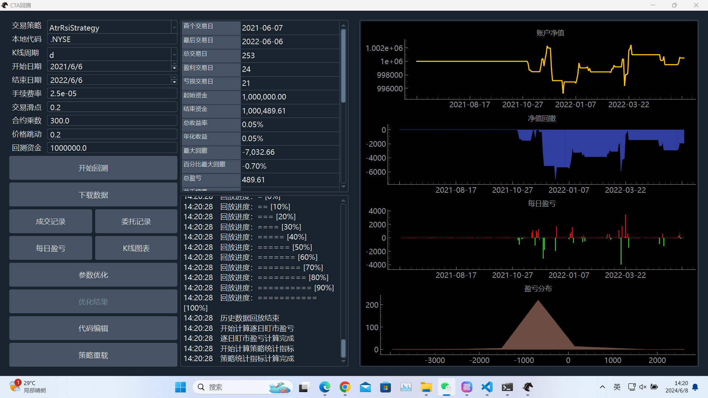

# An Investment Strategy with RL
This project is on Windows 11 64x. And it's OK for All Windows.

## Installation Steps

<!-- ### Setting Up VNpy Environment

This guide is based on VNpy. If you haven't used it before, you can create a virtual environment first.

```bash
conda create -n vnpy python==3.10.0
```

Activate the virtual environment:
```bash
conda activate vnpy
``` -->

### TA-Lib Installation Guide on Windows

This guide provides instructions on how to install TA-Lib on a Windows system using Visual Studio. You may get an error if you don't do it, this is because the ta-lib (which is neccessary to vnpy) is for 32-bit systems and is not compatible with 64-bit.

#### Prerequisites
- Download and unzip `ta-lib-0.4.0-msvc.zip`. You can find it [here](https://sourceforge.net/projects/ta-lib/files/ta-lib/0.4.0/ta-lib-0.4.0-msvc.zip/download?use_mirror=cfhcable).
- Visual Studio Community with the Visual C++ feature enabled. Ensure this is checked during installation.

#### Steps
1. **Set Up TA-Lib**:
   - Extract the `ta-lib` folder and place it at the root of your C: drive.


2. **Build TA-Lib**:
   - Open the `Native Tools Command Prompt` for Visual Studio.
   
    
   - Navigate to the TA-Lib source directory by entering:
     ```
     cd /d C:\ta-lib\c\make\cdr\win32\msvc
     ```
   - Build the library by running:
     ```
     nmake
     ```
### vnpy Installation Guide on Windows

#### Steps
1. **I have Modified `requirements.txt`**:
   - I have added several modules like `vnpy_ctastrategy`, `vnpy_ctabacktester`, and `vnpy_sqlite`,and`vnpy_datamanager`,e.t.c to `vnpy-3.9.1/requirements.txt`.So this step you can skip. Or you may pip install them.
   - In the original `vnpy-3.9.1/requirements.txt` in [vnpy GitHub repository](https://github.com/vnpy/vnpy), they are missing and you need to add them.

2. **Install vnpy**:
   - Navigate to the `vnpy-3.9.1` directory.
   - Run the installation batch file:
     ```
     install.bat
     ```
   - To start vnpy, use:
     ```
     cd ..
     python run.py
     ```

This setup will launch vnpy, ready for use. Then a window will pop up.


For more detailed information, please refer to the official [vnpy GitHub repository](https://github.com/vnpy/vnpy).


# Stock Trading Strategies with Kalman Filter and AC LSTM

This project implements and tests two advanced trading strategies using the VeighNa Trader platform: 
1. Kalman Filter Strategy
2. AC (Actor-Critic) LSTM Strategy

See all my code in `train_ac.ipynb` and folder `strategies`.

## Setup and Requirements

### 1. Install Required Libraries

```bash
pip install yfinance pykalman torch==2.1.0+cu121
```

### 2. Connect to CTP Interface
Register a [SimNow](https://www.simnow.com.cn/) account and follow the [documentation](https://www.vnpy.com/docs/cn/community/info/veighna_trader.html#id5) to connect to the CTP interface.


### 3. Download Stock Data
Use the yfinance library to download stock data for Alibaba (BABA).

```python
import yfinance as yf

ticker = 'BABA'
start_date = "2012-01-01"
end_date = "2024-05-01"

data = yf.download(ticker, start=start_date, end=end_date)
data.to_csv(f'{ticker}_stock_data.csv')
```

### 4. Import Data into VeighNa Trader
Import the downloaded data into the VeighNa Trader platform. Ensure that the column names match the expected format. You can do this manually or by editing the CSV file.


### 5. Kalman Filter Strategy
The Kalman Filter strategy is implemented in `kalman_strategy.py`. Place this file in the appropriate directory:

`C:\Users\YOUR_USER\strategies`
Or in your Python packages directory (e.g., `C:\Users\YOUR_USER\AppData\Roaming\Python\Python310\site-packages\vnpy_ctastrategy\strategies`)

### 6. AC LSTM Strategy
The AC LSTM strategy is implemented in `ac_lstm_strategy.py`. Ensure to modify the model loading path in the strategy file to match your environment.

```python
self.model_path = 'path_to_your_model\ac_lstm_model.pth'
```
## Training the AC LSTM Model
Train the AC LSTM model using the `scripts/train_ac.ipynb` notebook or `scripts/train_ac.py`.

```python
# Example parameters
csv_file = '../data/BABA_stock_data.csv'
model_path = '../saved_models/ac_lstm_model.pth'
loss_file_path = '../saved_models/ac_loss_record.csv'
input_dim = 5
hidden_dim = 128
action_dim = 3
learning_rate = 1e-4
num_epochs = 150
seq_length = 30

dataset = StockDataset(csv_file, seq_length=seq_length, end_date='2021-06-06')
sampler = SequentialSampler(dataset)
batch_sampler = BatchSampler(sampler, batch_size=32, drop_last=False)
dataloader = DataLoader(dataset, batch_sampler=batch_sampler)

model = ActorCritic(input_dim, hidden_dim, action_dim)
optimizer = optim.Adam(model.parameters(), lr=learning_rate)

train_ac(model, dataloader, optimizer, num_epochs, model_path, loss_file_path)
```

## Running Backtests
To run backtests, follow these steps:

Click on CTA Backtesting in the main menu.
Select the desired strategy (e.g., AC_LSTM_Strategy, KalmanFilterStrategy).
Choose the local data corresponding to your imported data (e.g., .NYSE).
Set the start and end dates for the backtest.


### Backtest Results
AC LSTM Strategy


### Kalman Filter Strategy


### Turtle Signal Strategy


### ATR RSI Strategy


## Conclusion
In conclusion, while default strategies like AtrRsiStrategy and TurtleSignalStrategy hovered around 0% returns, the Kalman Filter strategy achieved an annual return of 20%, and the LSTM Actor-Critic model demonstrated even more impressive results.

## Reference

1. [CTA Strategy Documentation](https://www.vnpy.com/docs/cn/community/app/cta_strategy.html#ctastrategy-cta)
2. [VN.py GitHub Repository](https://github.com/vnpy/vnpy)
3. [VN.py Documentation](https://www.vnpy.com/docs/cn/index.html)
4. [VN.py 2.9 中文手册 - Part 1](https://www.bookstack.cn/read/vnpy-2.9-zh/spilt.2.8ad19f9e3fc23612.md)
5. [VN.py 2.9 中文手册 - Part 2](https://www.bookstack.cn/read/vnpy-2.9-zh/ea23d23d6e3bcf79.md)


## License
This project is licensed under the MIT License - see the LICENSE.md file for details.
